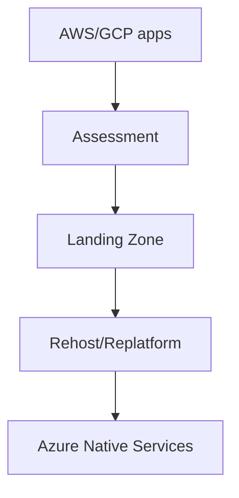

# AWS/GCP to Azure Migration

This repository provides mapping, modernization, and architecture guidance for organizations migrating workloads from AWS or GCP into Azure.

```mermaid
flowchart TD
    A[AWS/GCP apps] --> B[Assessment]
    B --> C[Landing Zone]
    C --> D[Rehost/Replatform]
    D --> E[Azure Native Services]
```
